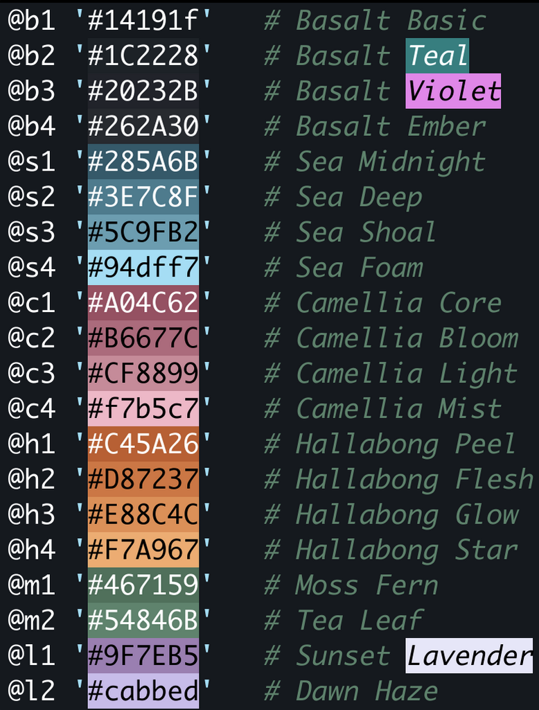

# Jeju One Dark
An elegant theme for syntax highlights and UI styles, easy on the eyes. The color palette resembles the beautiful landscape of Jeju Island, Korea.

## The Palette


## Sublime Text
Straightforward json configuration. Copy the scheme provided under `jeju-one-dark-sublime/` to your Packages directory, then load. I am open to publishing this on Package Control very soon.


## Zed
Use the command palette to install as dev extension.


## VSCode
Use the command palette to install as dev extension, or drag-and-drop the vsix file. This extension was built and tested on VSCodium, a fully open-source fork build, but will be compatible.


## Emacs
Copy the `.el` file under `.emacs.d/themes/` and edit `.emacs.d/init.el` or `.emacs` to load theme on startup. Specifically, add this snippet:
```
;; ~/.emacs or init.el
(add-to-list 'custom-theme-load-path
             (expand-file-name "themes" user-emacs-directory))
(load-theme 'jeju-one-dark t) 
```


Basalt (b1–b4)

@b1 '#14191f'   # Basalt Basic
@b2 '#1C2228'   # Basalt Teal
@b3 '#20232B'   # Basalt Violet
@b4 '#262A30'   # Basalt Ember
Sea (s1–s4)

@s1 '#285A6B'   # Sea Midnight
@s2 '#3E7C8F'   # Sea Deep
@s3 '#5C9FB2'   # Sea Shoal
@s4 '#94dff7'   # Sea Foam
Camellia (c1–c4)

@c1 '#A04C62'   # Camellia Core
@c2 '#B6677C'   # Camellia Bloom
@c3 '#CF8899'   # Camellia Light
@c4 '#f7b5c7'   # Camellia Mist
Hallabong (h1–h4)

@h1 '#C45A26'   # Hallabong Peel
@h2 '#D87237'   # Hallabong Flesh
@h3 '#E88C4C'   # Hallabong Glow
@h4 '#F7A967'   # Hallabong Star
Moss (m1–m2)

@m1 '#467159'   # Moss Fern
@m2 '#54846B'   # Tea Leaf
Lavender (l1–l2)

@l1 '#9F7EB5'   # Sunset Lavender
@l2 '#cabbed'   # Dawn Haze
